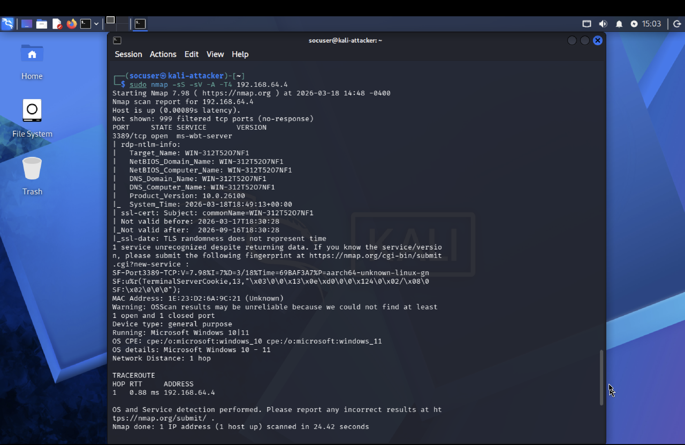
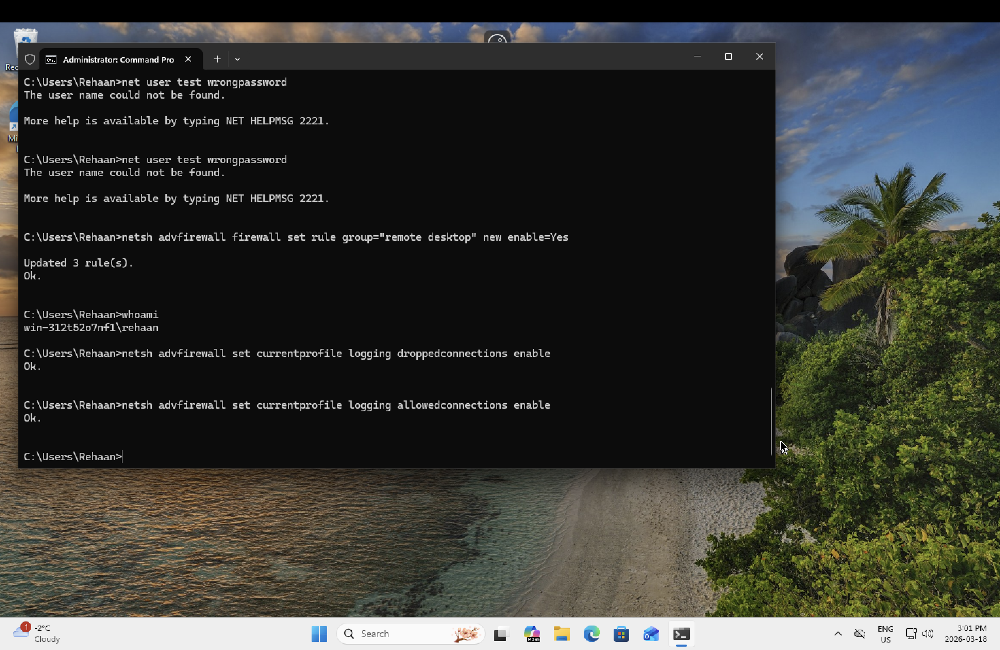
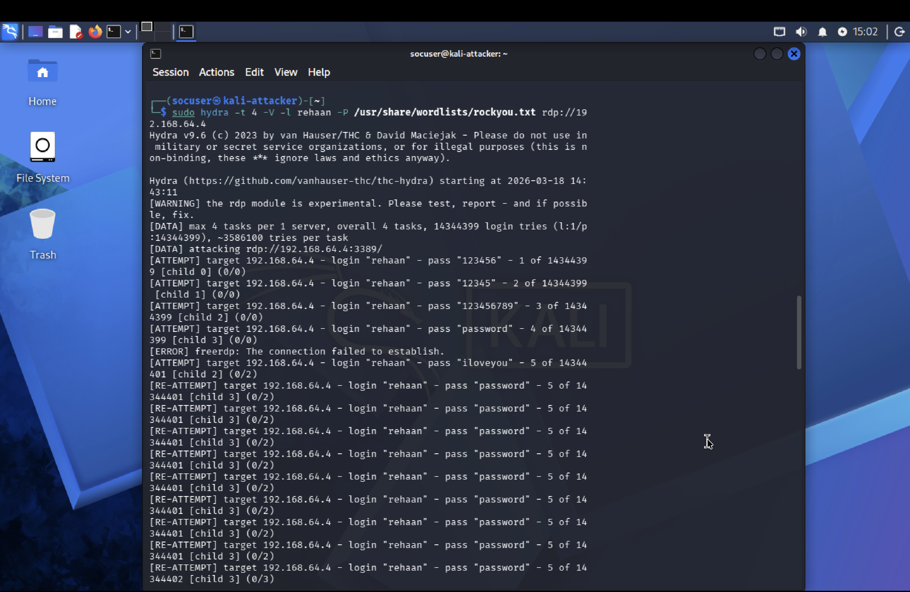
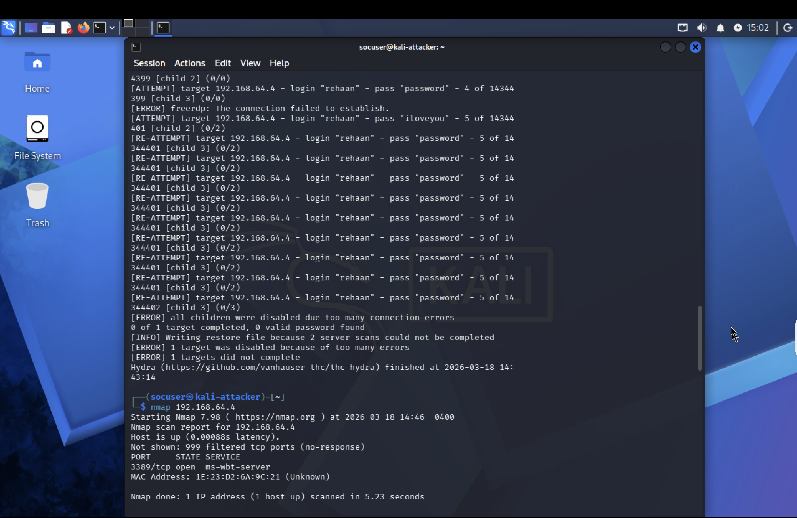
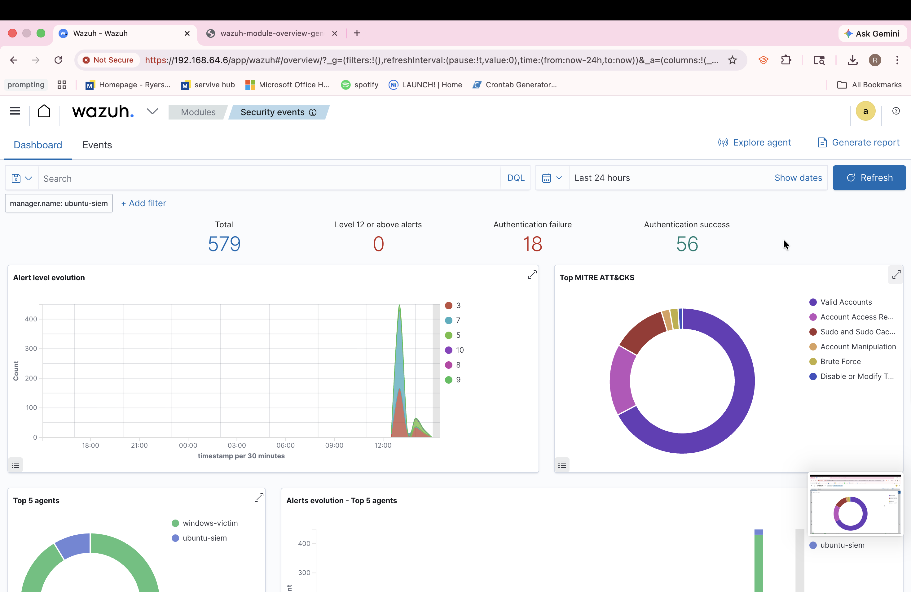
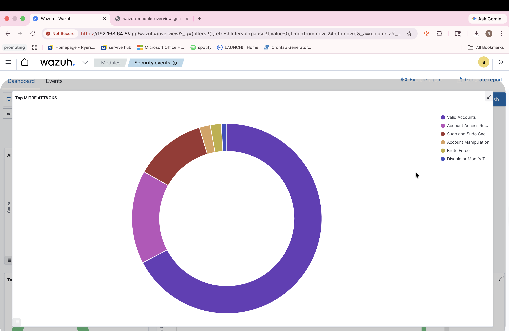

# 🛡️ SOC Home Lab with Wazuh SIEM

### 🔍 Detection Engineering | Threat Simulation | MITRE ATT&CK Mapping

---

## 🚀 Executive Summary

This project demonstrates the design and implementation of a **Security Operations Center (SOC) home lab** capable of detecting and analyzing real-world attack techniques.

A simulated attacker environment (Kali Linux) was used to perform reconnaissance and brute-force attacks against a Windows endpoint, while a Wazuh SIEM (hosted on Ubuntu) collected, analyzed, and visualized security events.

The lab successfully demonstrates **end-to-end threat detection**, from attack execution to SIEM-based analysis and MITRE ATT&CK classification.

---

## 🧠 Key Capabilities Demonstrated

* ✅ SIEM deployment and configuration (Wazuh)
* ✅ Endpoint log ingestion and monitoring
* ✅ Brute-force attack simulation using Hydra
* ✅ Network reconnaissance using Nmap
* ✅ Detection and visualization of authentication abuse
* ✅ MITRE ATT&CK-based threat classification
* ✅ Identification of detection gaps and limitations

---

## 🏗️ Lab Architecture

```
Kali Linux (Attacker)
        ↓
Windows Endpoint (Victim)
        ↓
Wazuh Agent → Wazuh Manager (Ubuntu SIEM)
        ↓
Wazuh Dashboard (Detection & Visualization)
```

---

## 🛠️ Technology Stack

| Category          | Tools                              |
| ----------------- | ---------------------------------- |
| SIEM              | Wazuh                              |
| Virtualization    | UTM                                |
| Operating Systems | Ubuntu Server, Windows, Kali Linux |
| Offensive Tools   | Hydra, Nmap                        |
| Logging           | Windows Event Logs                 |

---

## ⚔️ Attack Lifecycle Simulation

### 🔍 1. Reconnaissance – Nmap Enumeration

An advanced Nmap scan (`-sS -sV -A -T4`) was used to identify exposed services and system details.

**Findings:**

* Port **3389 (RDP)** open
* Windows OS fingerprint identified
* Service and hostname enumeration

📌 *Insight:* This phase identifies the attack surface and potential entry points.

---

### 💥 2. Exploitation – Hydra Brute Force Attack

A brute-force attack was executed against the RDP service using Hydra and a common password wordlist.

**Attack Characteristics:**

* Parallel login attempts
* High-frequency authentication requests
* Credential guessing simulation

📌 *Insight:* Represents real-world credential access attacks targeting weak passwords.

---

### 🔴 3. Log Generation – Failed Authentication Events

Manual failed login attempts were generated on the Windows system to ensure consistent log creation.

**Outcome:**

* Windows Security Event Logs populated
* Authentication failures recorded
* Events forwarded to Wazuh

---

## 📊 Detection & Threat Analysis

### ✅ SIEM Detection (Wazuh)

Wazuh successfully:

* Ingested Windows security logs
* Detected repeated authentication failures
* Visualized attack patterns through event spikes

---

### 🧬 MITRE ATT&CK Mapping

Detected events were mapped to:

* **T1110 – Brute Force**
* **Valid Accounts**
* **Account Manipulation**

📌 *Insight:* This enables structured threat analysis aligned with industry frameworks.

---

### 🚫 Detection Limitations (Critical Insight)

Nmap reconnaissance activity was **not strongly detected** by default.

**Reason:**

* Wazuh is primarily a **host-based SIEM**
* Network scans generate limited endpoint-level logs

**Implication:**

* Requires integration with:

  * Network IDS (Suricata / Zeek)
  * Enhanced firewall logging

📌 *Key Takeaway:*
A mature SOC requires **both host-based and network-based visibility**

---

## 📊 Visual Evidence

### 🧠 Advanced Reconnaissance – Nmap Service & OS Detection



---

### ⚙️ RDP & Firewall Logging Configuration (Windows Victim)



---

### 🔴 Simulated Failed Login Attempts (Windows)


---

### 💥 Brute Force Attack – Hydra RDP Password Cracking



---

### 🚫 Brute Force Limitations – Connection Errors & Rate Limiting



---

### 📊 SIEM Detection – Wazuh Dashboard



---

### 🧬 Threat Classification – MITRE ATT&CK Mapping (Wazuh)



---

## Key Security Insights

* SIEM effectiveness depends on **log availability and configuration**
* Authentication-based attacks are **highly detectable via endpoint logs**
* Network reconnaissance requires **additional telemetry sources**
* Attack simulation is essential for validating detection capabilities

---

##  Future Enhancements

* Integrate **Sysmon** for advanced Windows telemetry
* Deploy **Suricata/Zeek** for network-based detection
* Develop **custom Wazuh detection rules**
* Implement alert correlation and severity tuning

---

---

## Author

**Rehaan**


Business Technology Management Student


Cybersecurity Enthusiast

---
